## Hypothesis testing and p-values
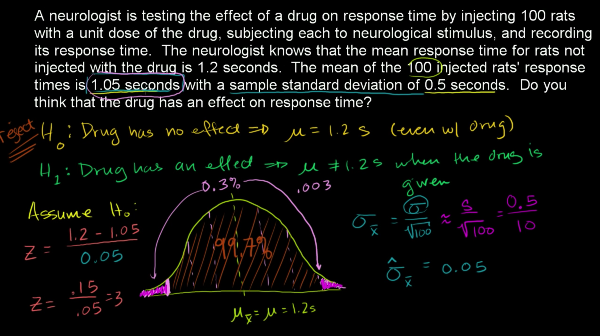

## One-tailed and two-tailed test
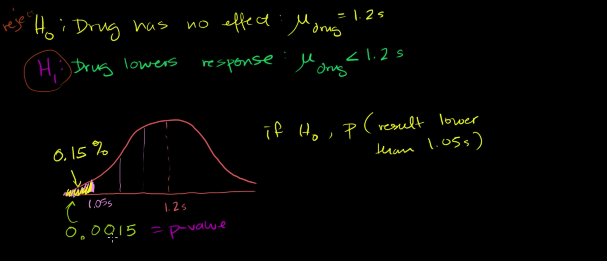
## Z-statistics vs. T-statistics
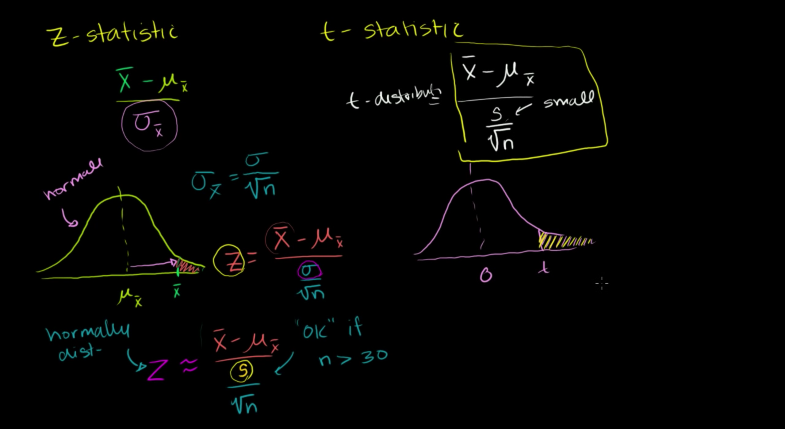
## Small sample hypothesis test
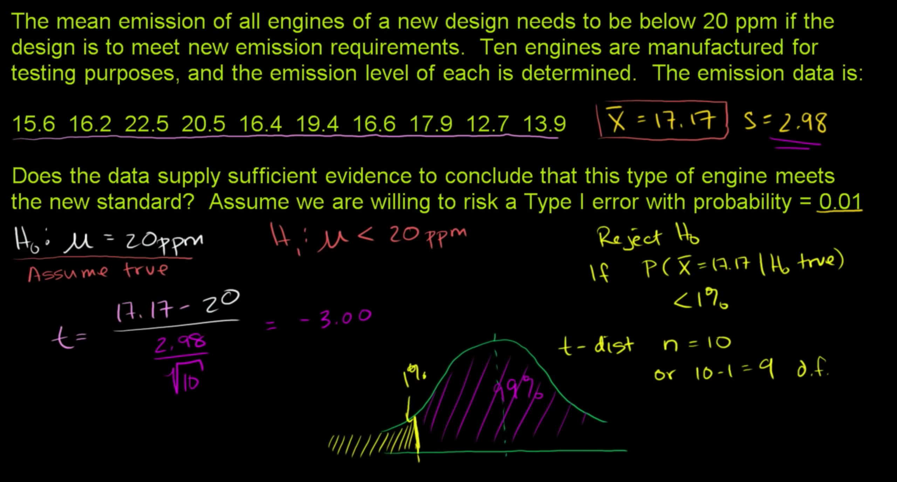
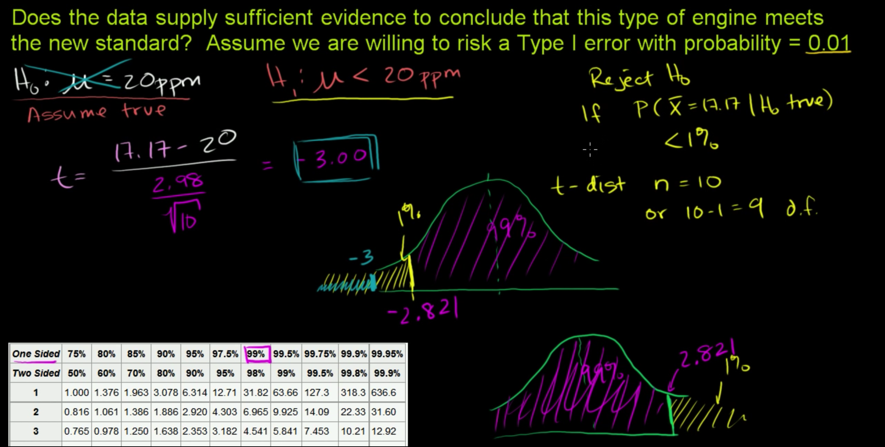
## Large sample proportion hypothesis testing
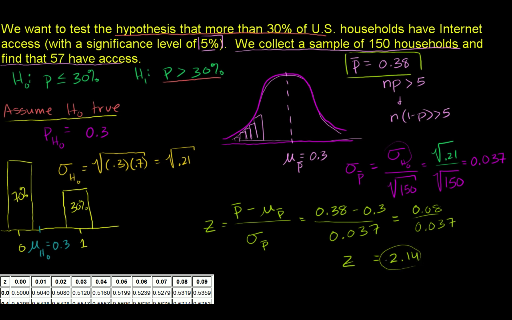
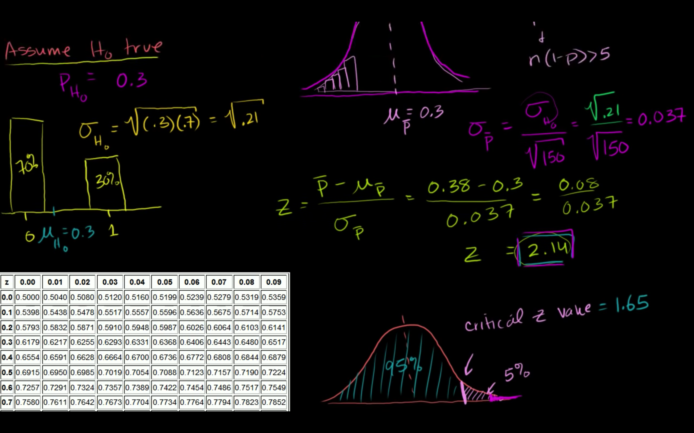
## Comments
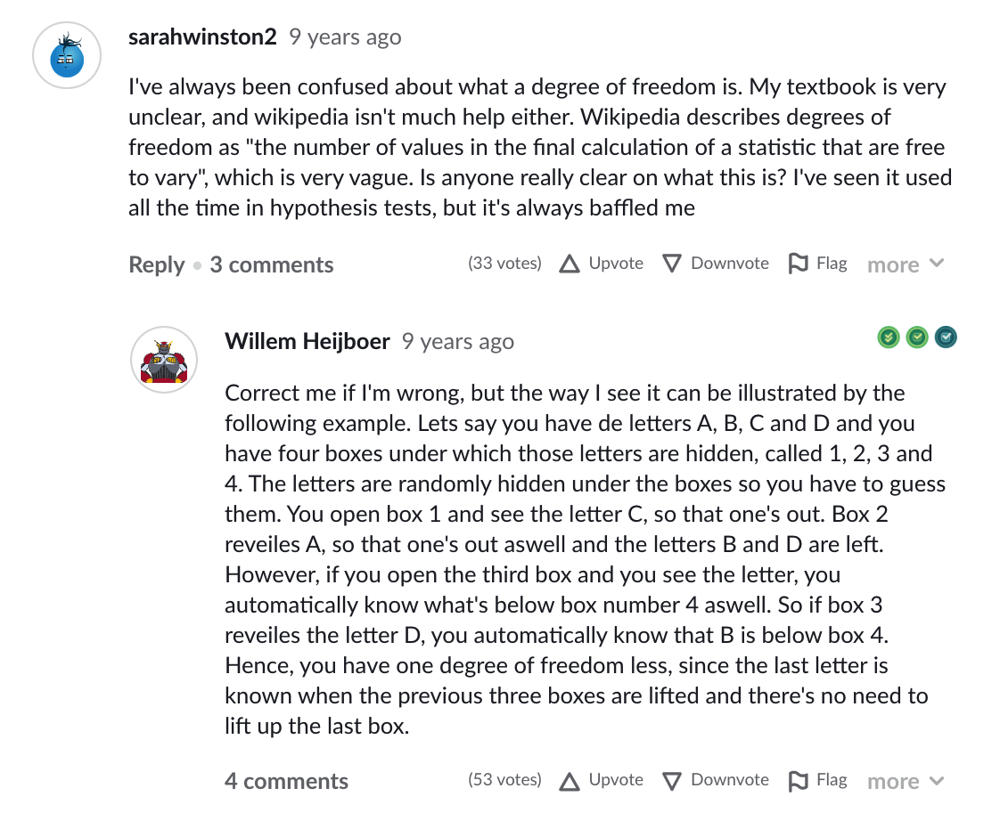
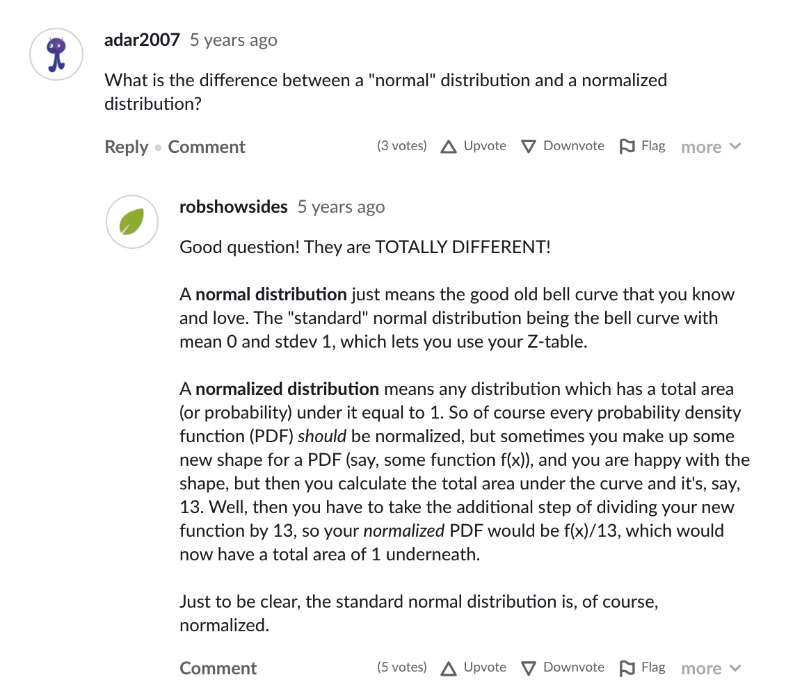
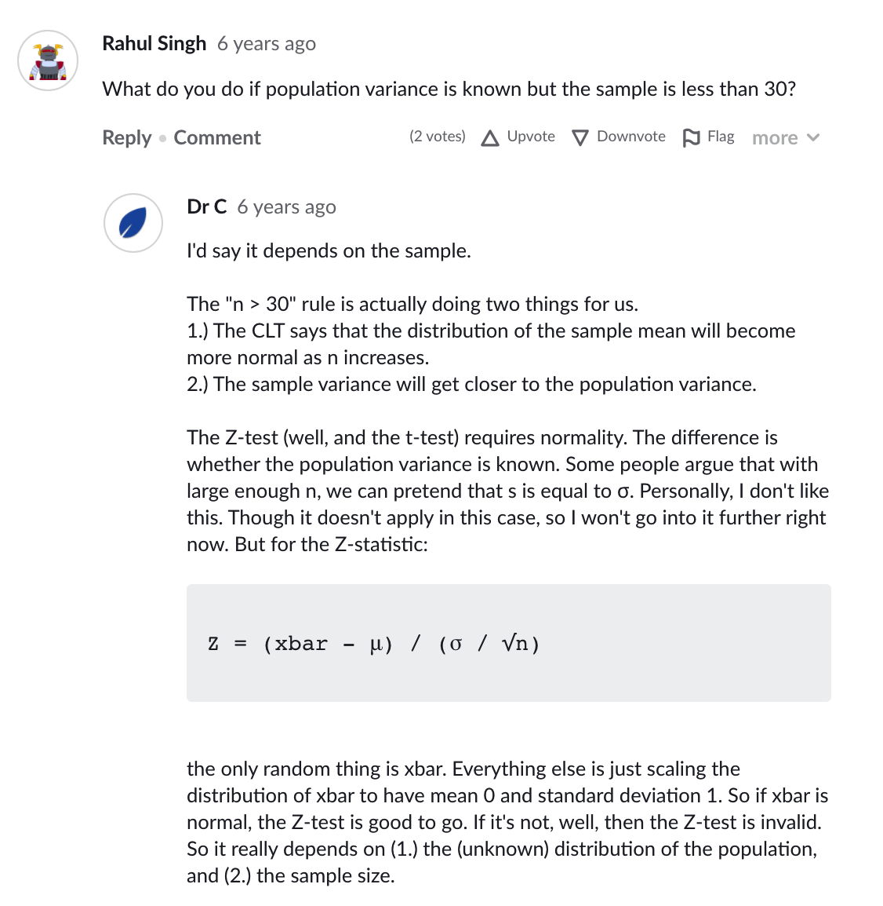
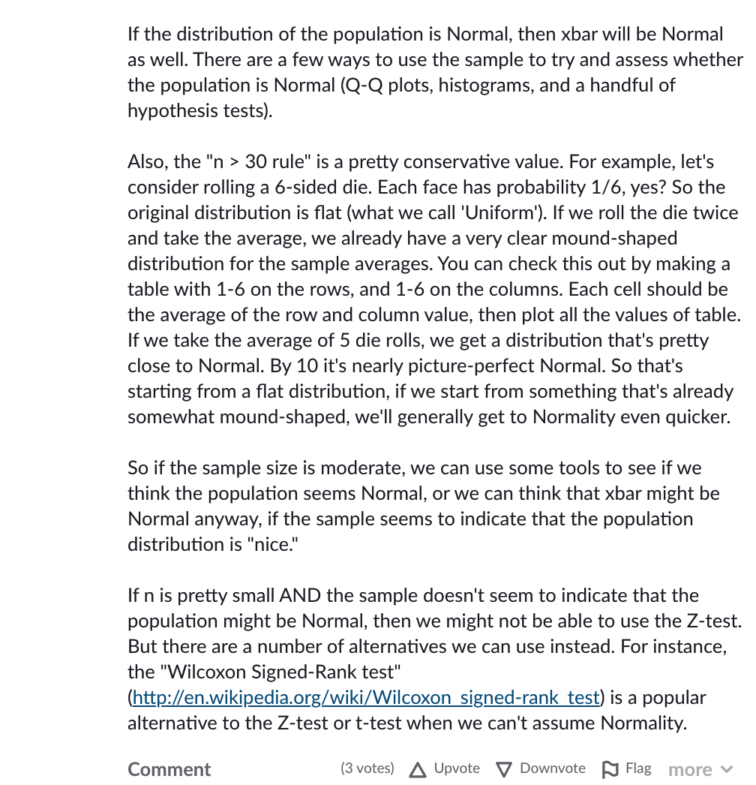
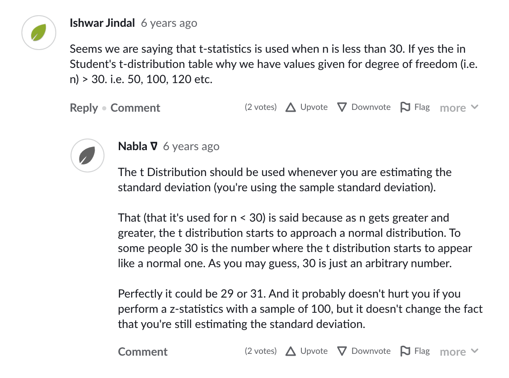
