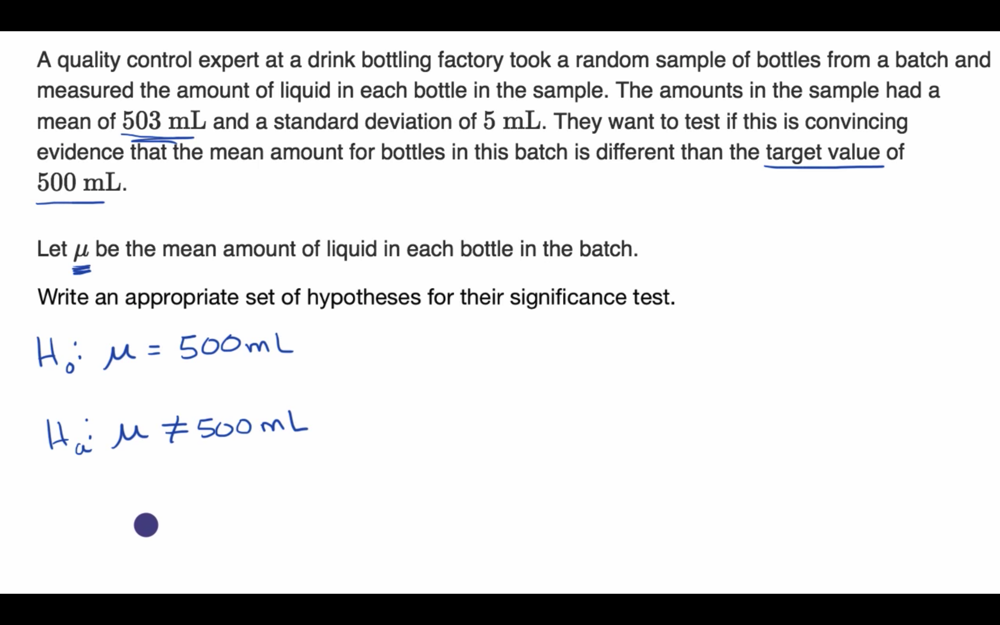

## Writing hypotheses for a significance test about a mean

## Conditions for a t test about a mean

## When to use z or t statistics in significance tests

## Example calculating t statistic for a test about a mean

## Using TI calculator for P-value from t statistic

## Using a table to estimate P-value from t statistic

## Comparing P-value from t statistic to significance level

## Free response example: Significance test for a mean

