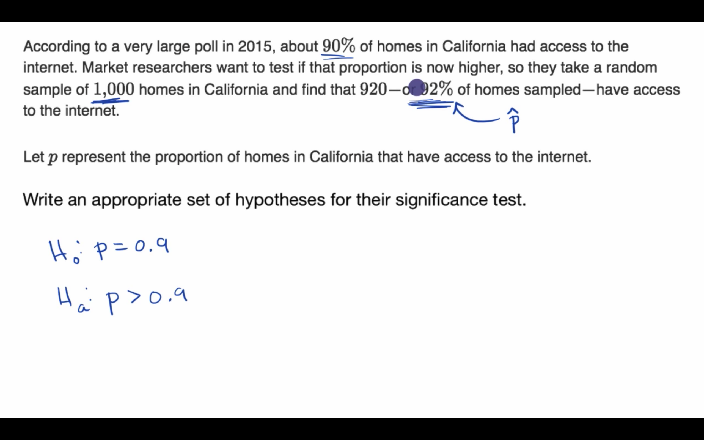
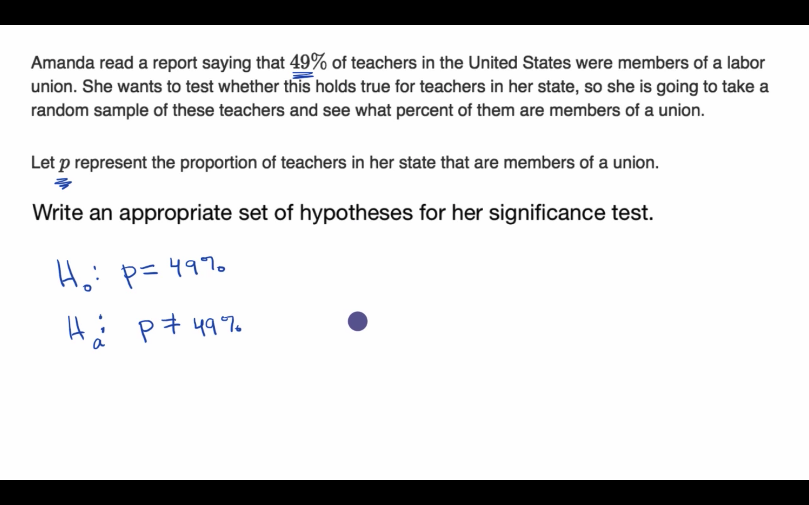
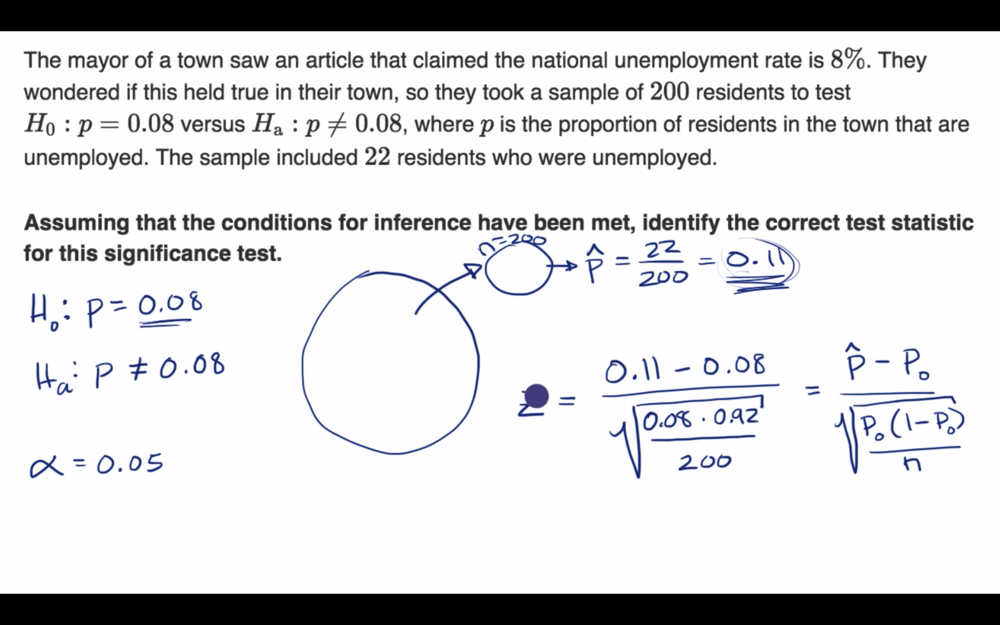
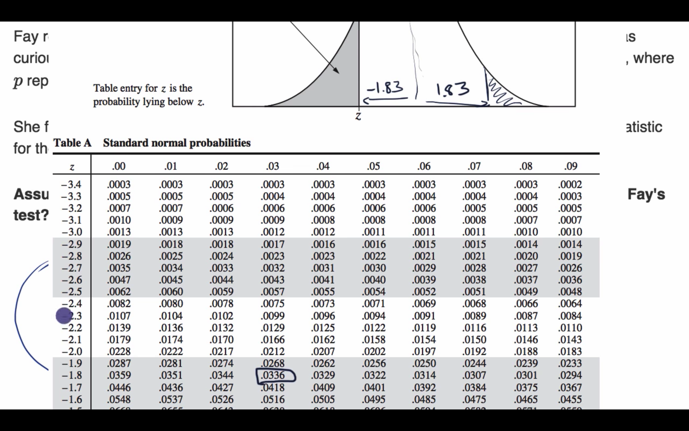
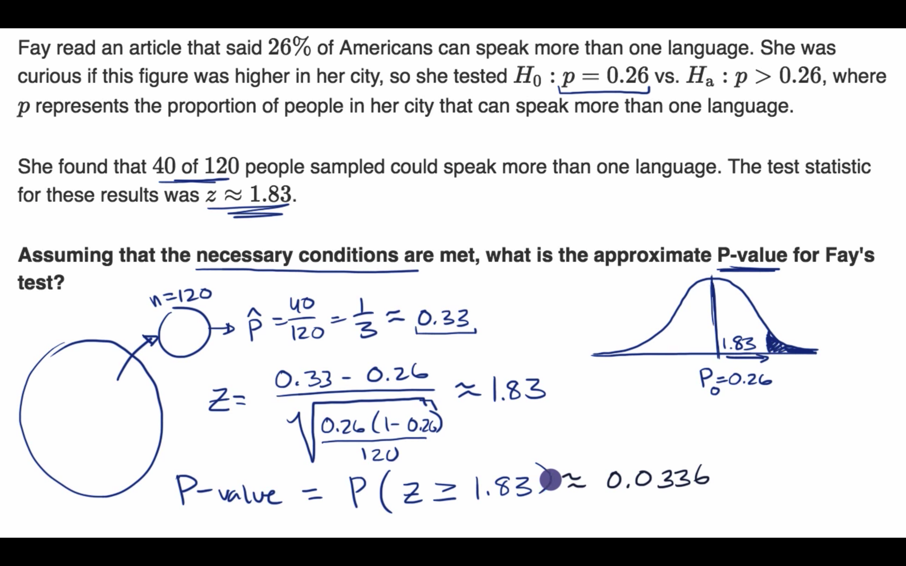
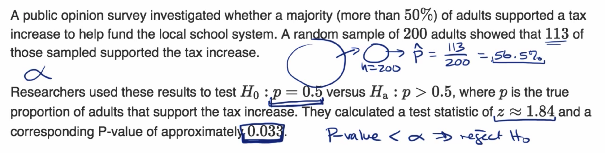
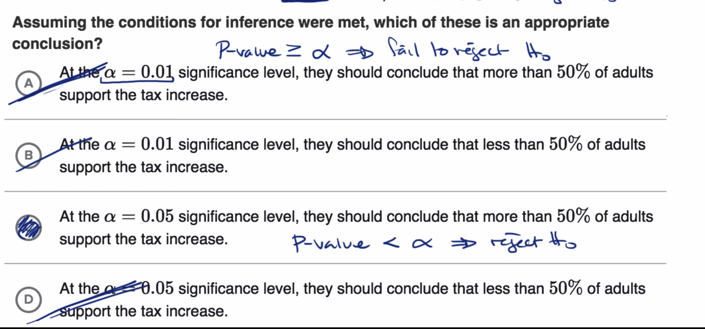

## Constructing hypotheses for a significance test about a proportion

## Conditions for a z test about a proportion

## Calculating a z statistic in a test about a proportion

## Calculating a P-value given a z statistic

## Making conclusions in a test about a proportion

