## Standard Normal Table for proportion below
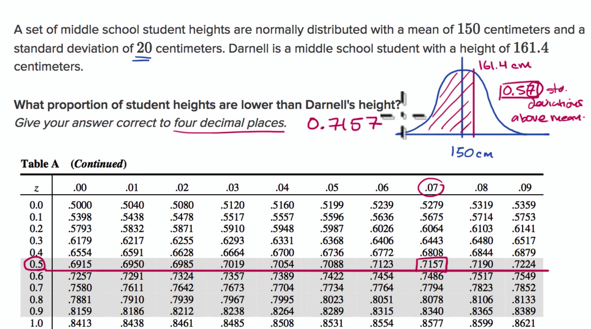
## Standard Normal Table for proportion above
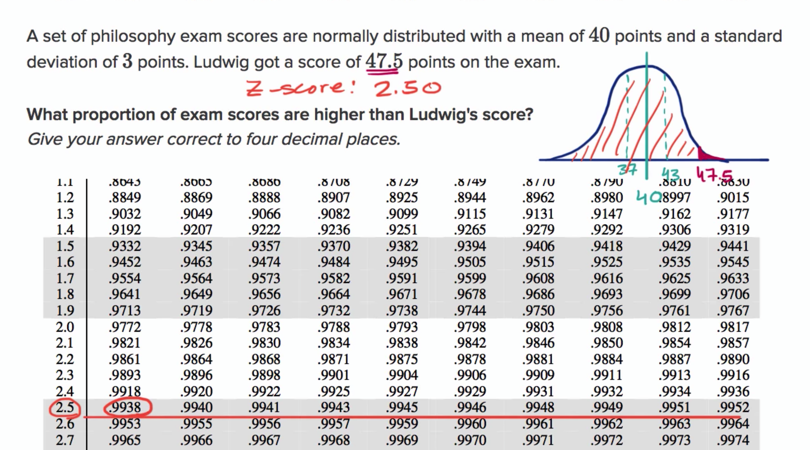
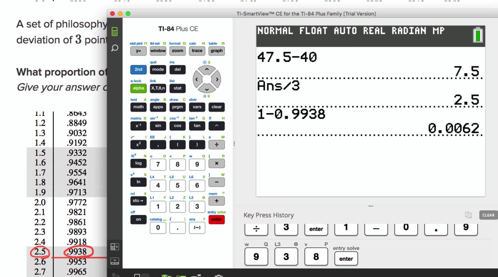
## Standard Normal Table for proportion between
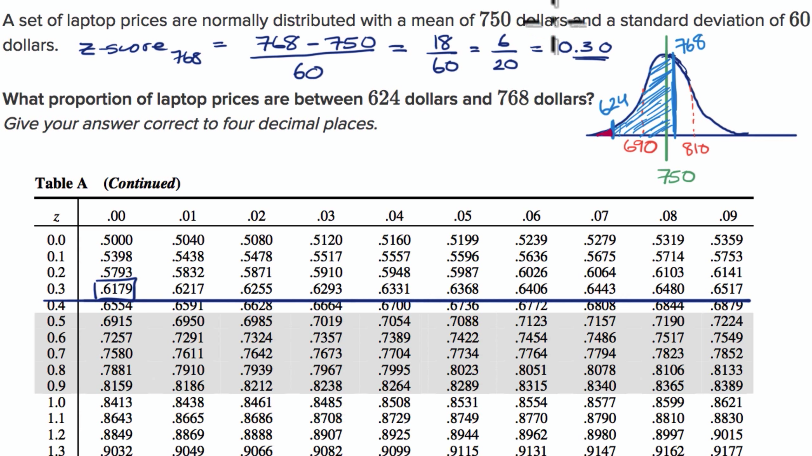
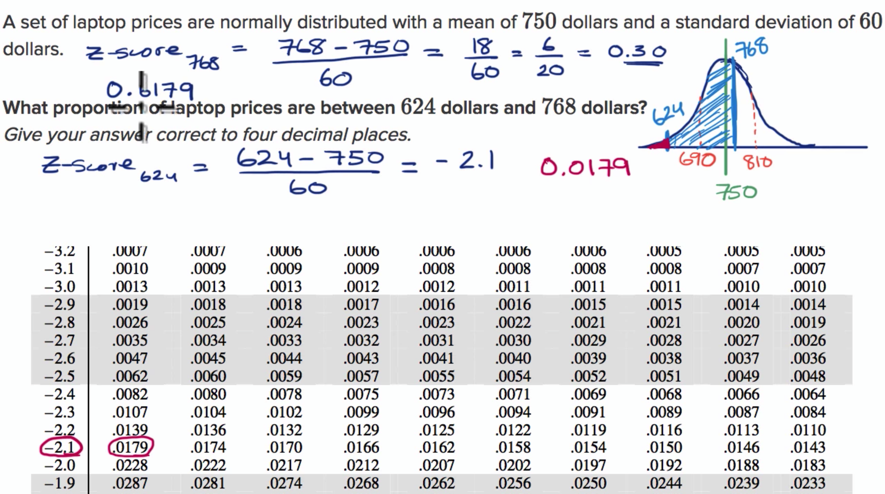
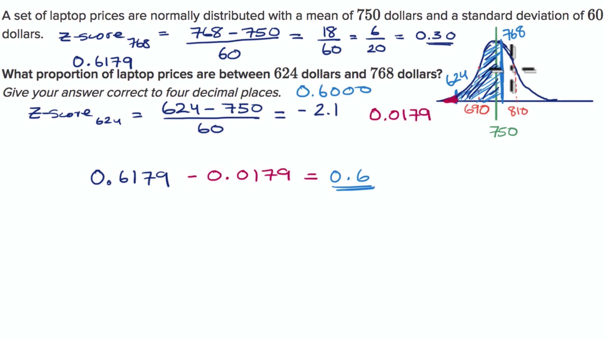
## Finding z-score for percentile 
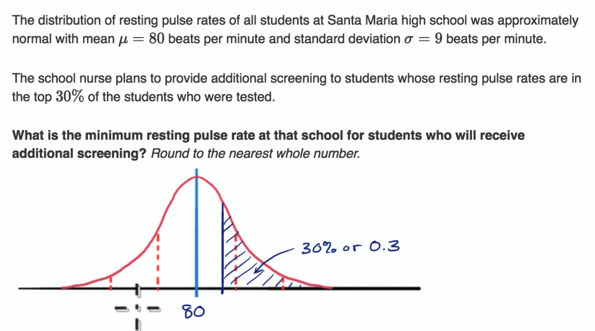
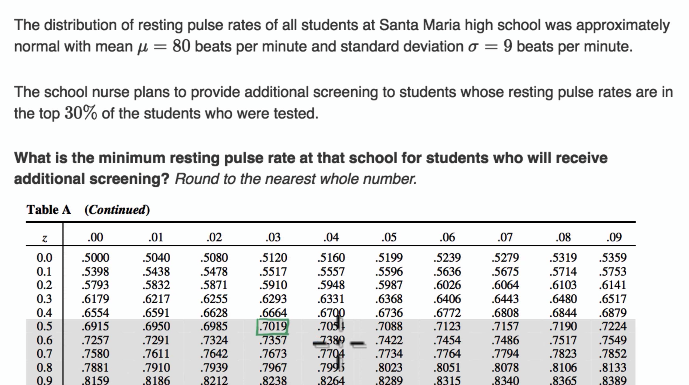
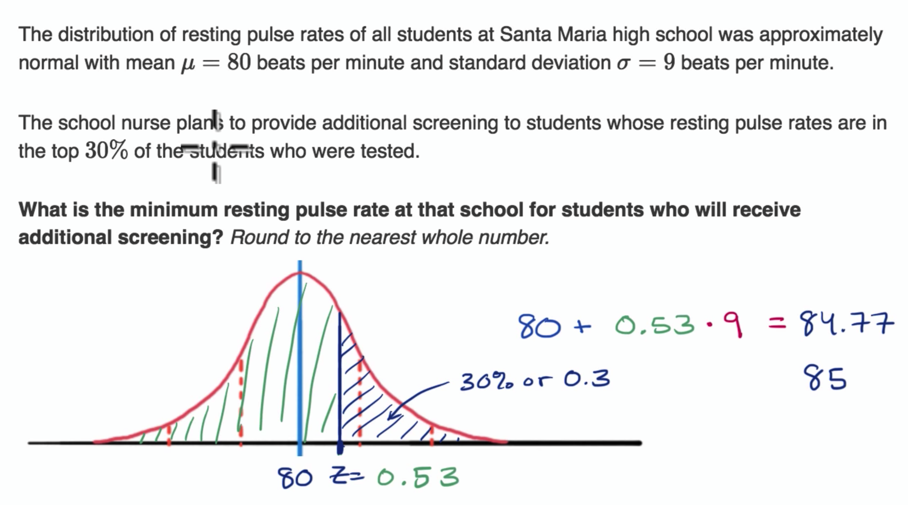
## Threshold for low percentile
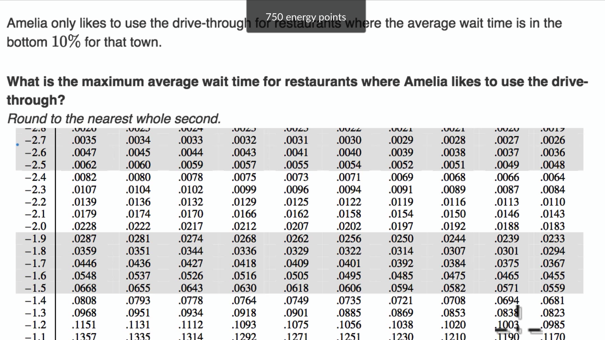
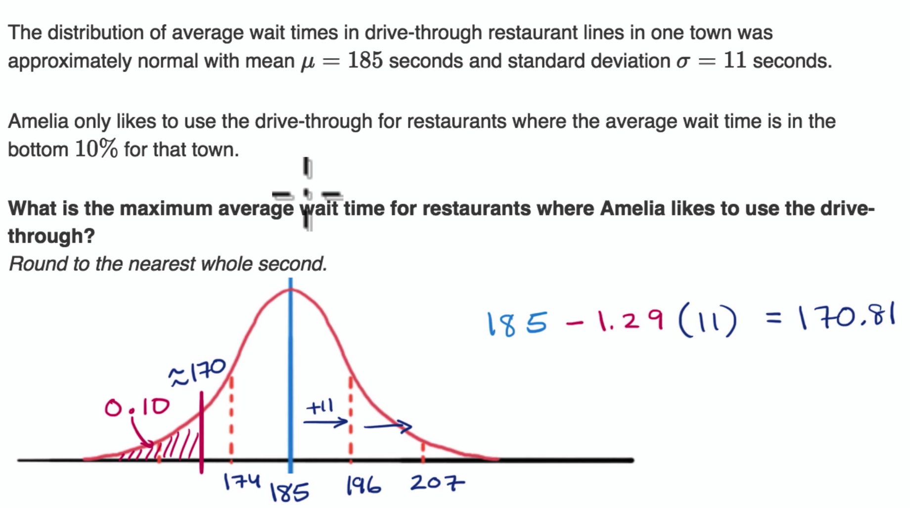
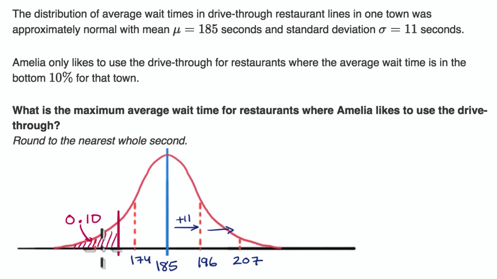
