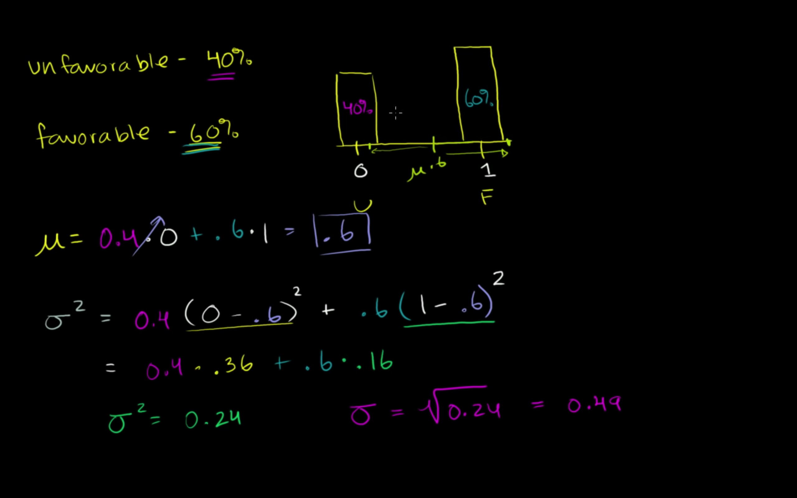
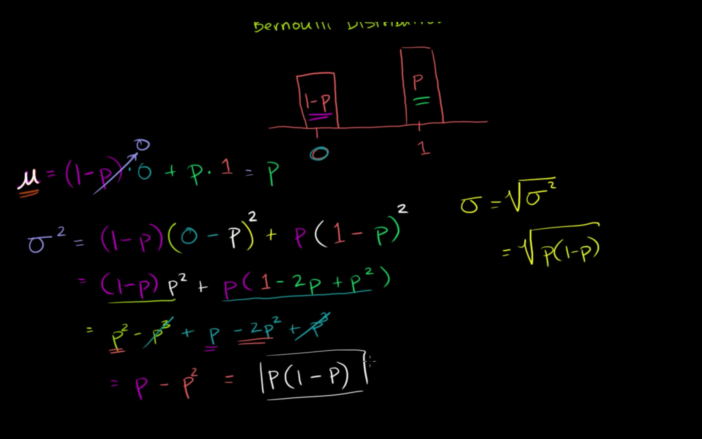
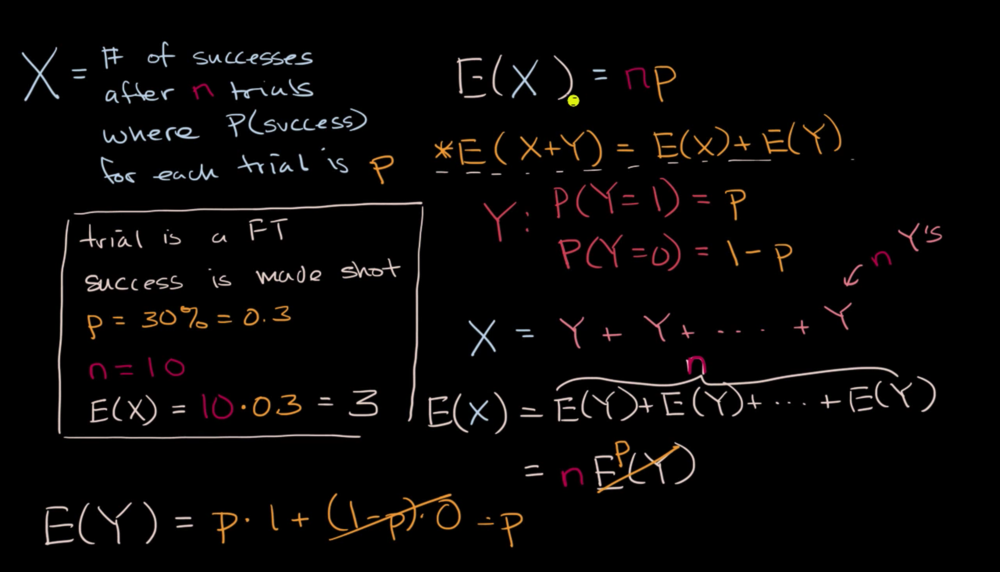
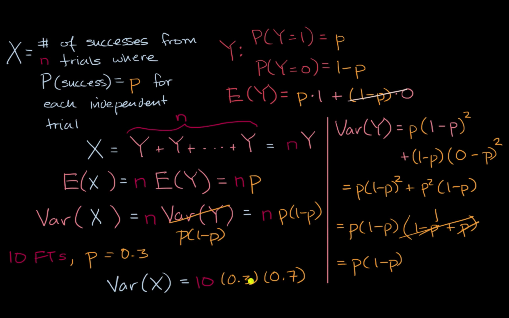
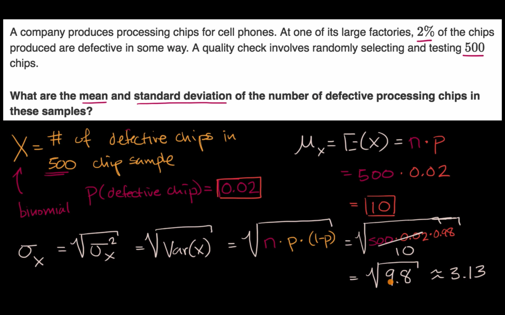

## Mean and variance of Bernoulli distribution example

## Bernoulli distribution mean and variance formulas

## Expected value of a binomial variable

## Variance of a binomial variable

## Finding the mean and standard deviation of a binomial random variable

