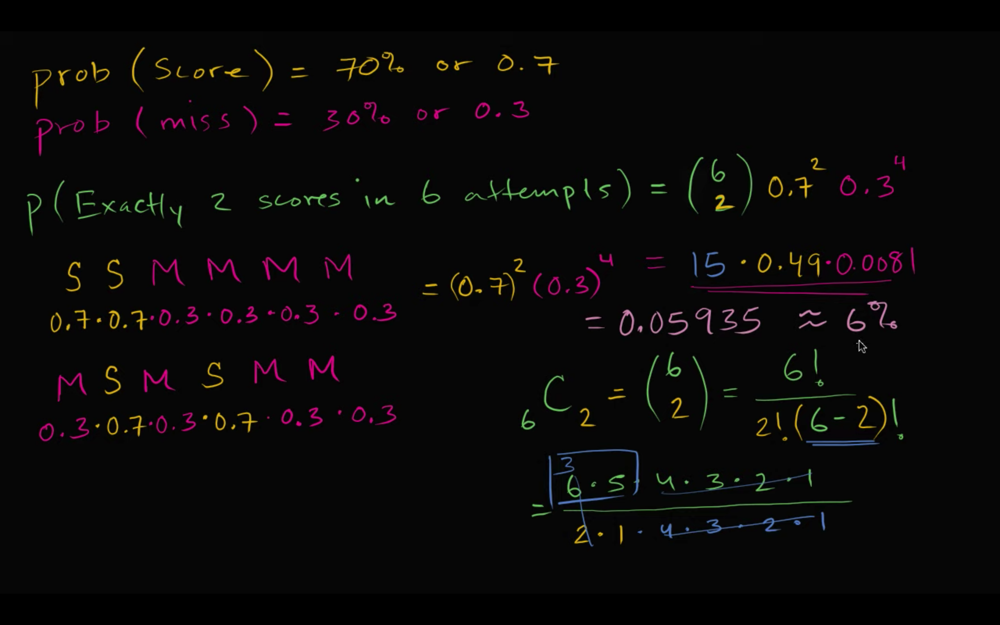
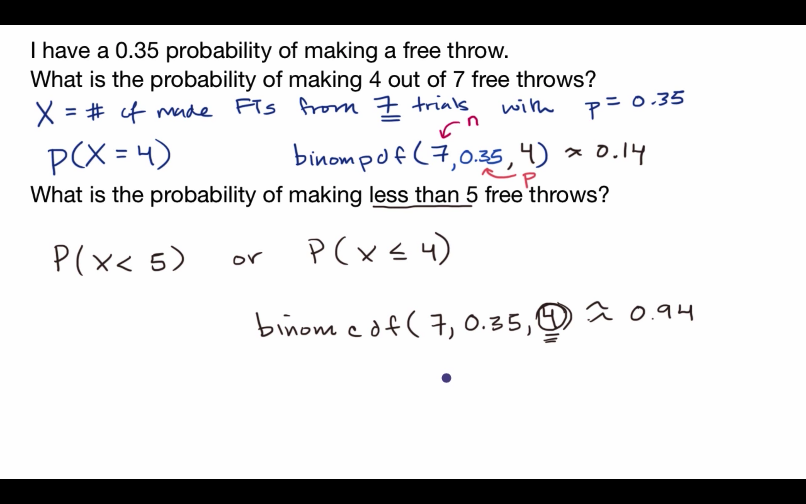

## Binomial variables

## Recognizing binomial variables

## 10% Rule of assuming "independence" between trials

## Binomial distribution

## Visualizing a binomial distribution

## Binomial probability example

## Generalizing k scores in n attempts

## Free throw binomial probability distribution

## Graphing basketball binomial distribution

## Binompdf and binomcdf functions

## Binomial probability (basic)

