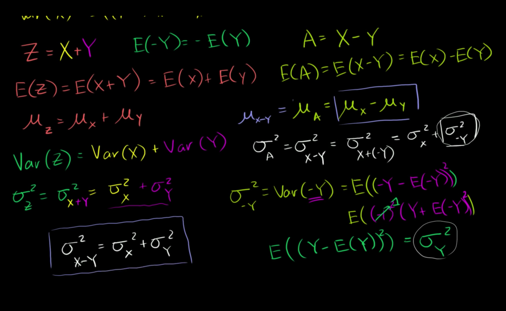
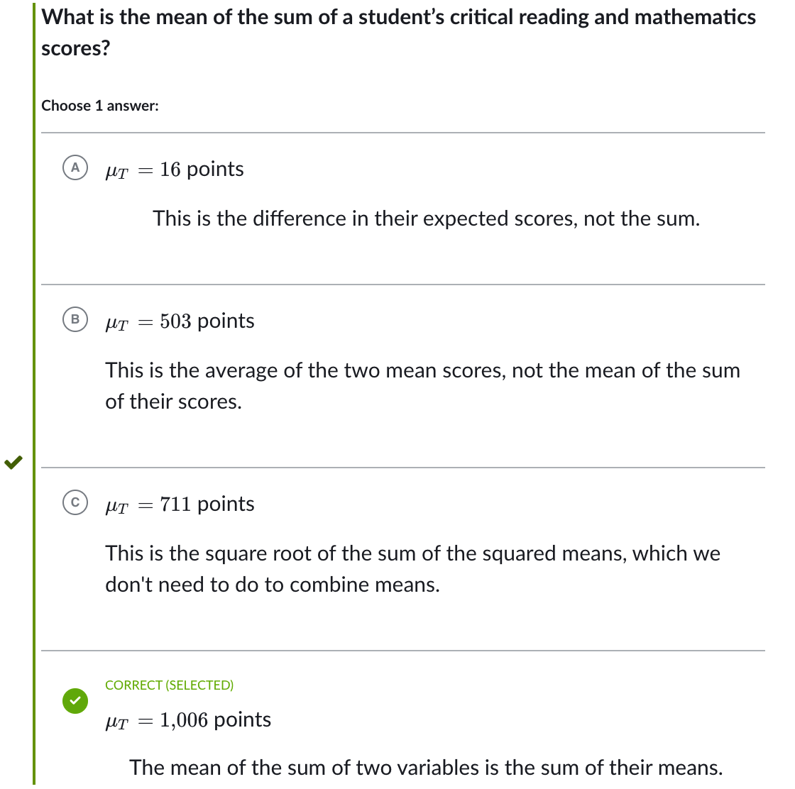
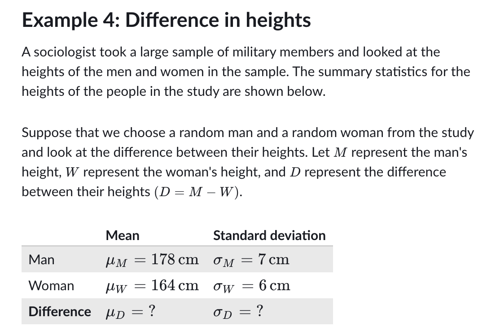

## Mean of sum and difference of random variables

## Variance of sum and difference of random variables

## Intuition for why independence matters for variance of sum

## Deriving the variance of the difference of random variables

## Combining random variables

