## Discrete Random Variables
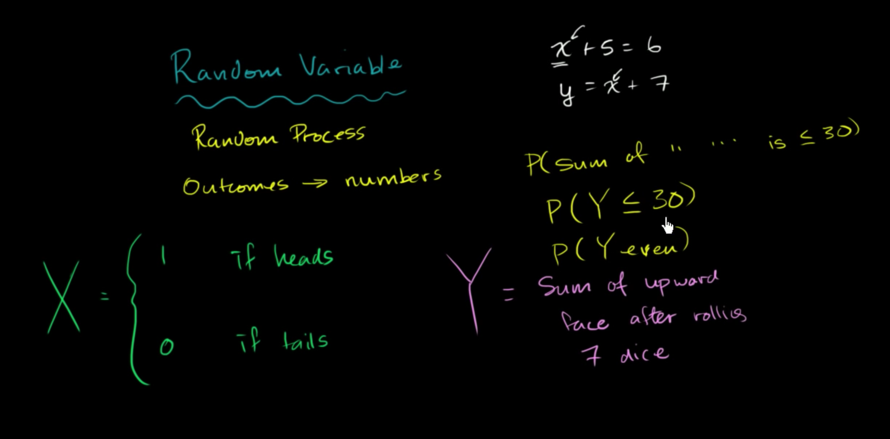
## Random Variable Types
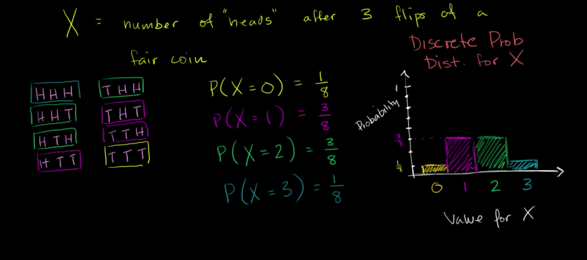
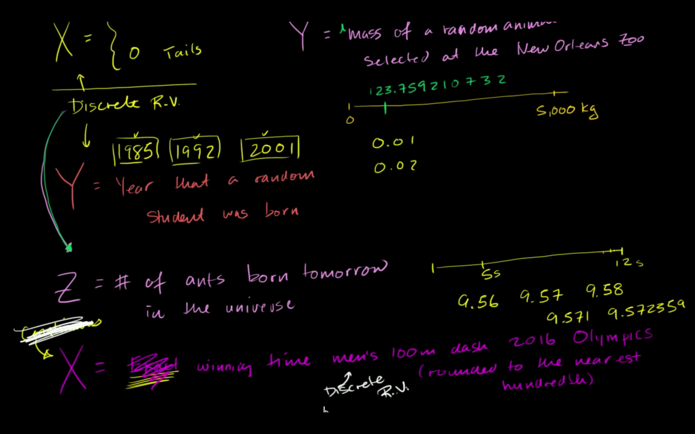
## Contructing a probability distribution for random variable
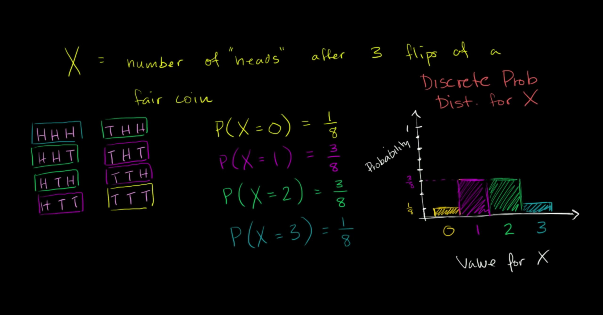
## Probabaility models example: frozen yogurt
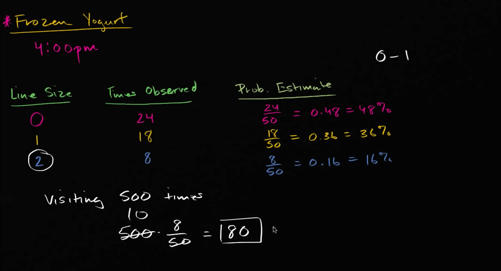
## Valid probabaility distribution example
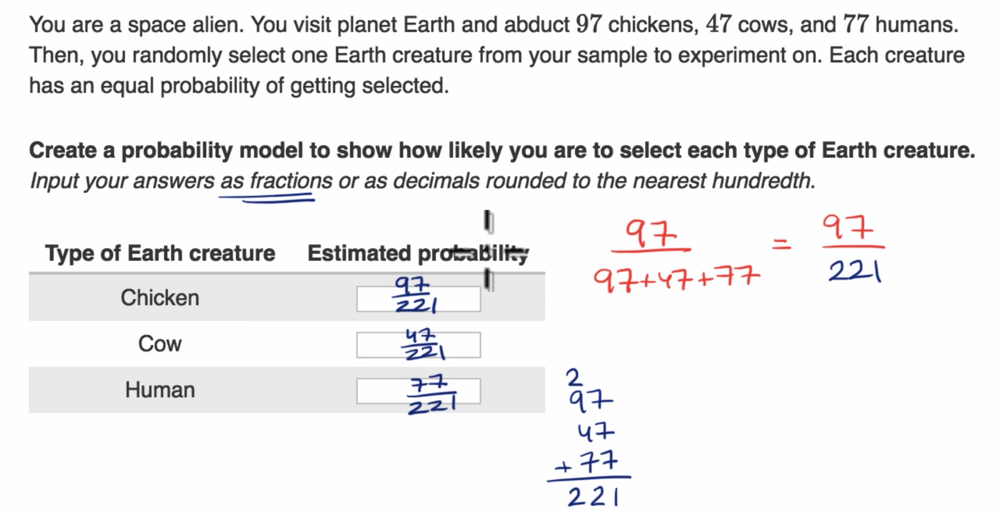
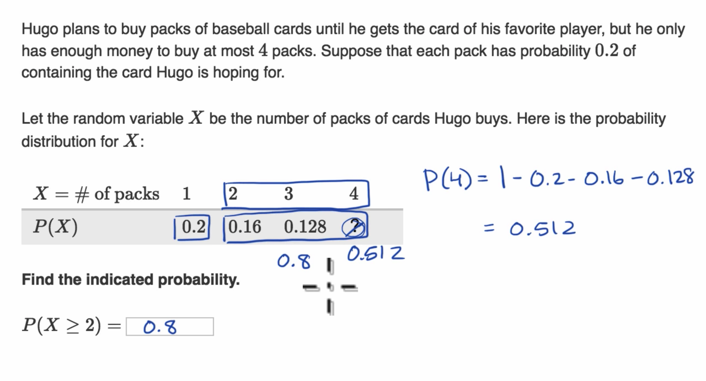
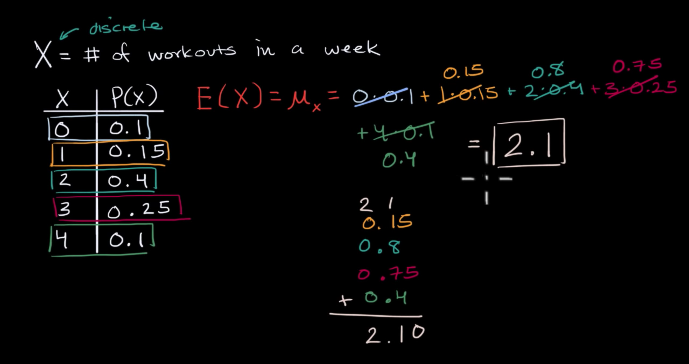
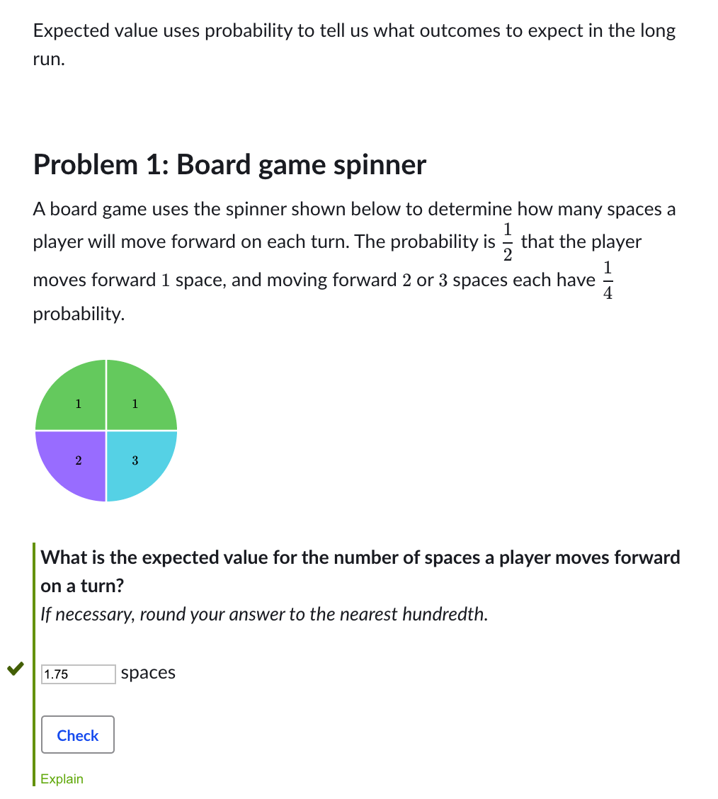
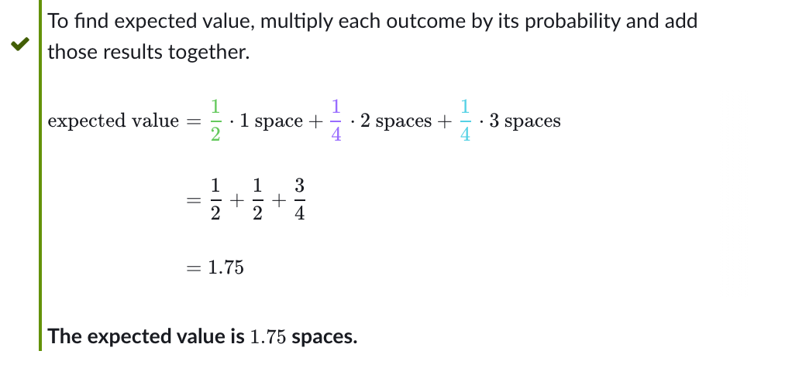
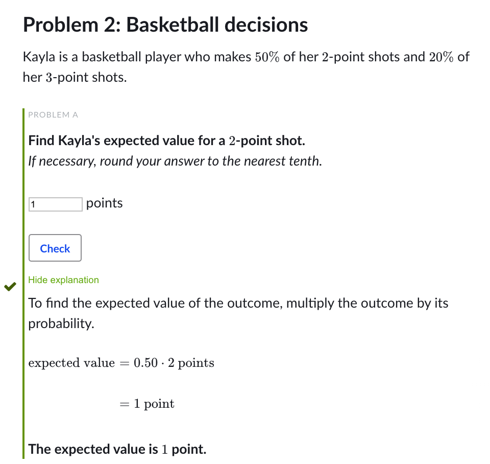
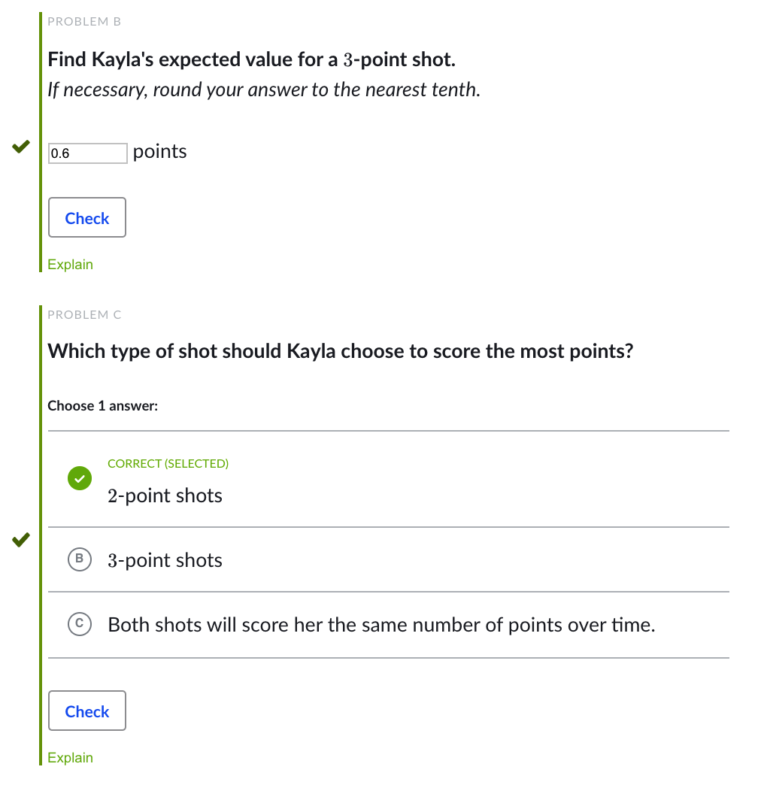
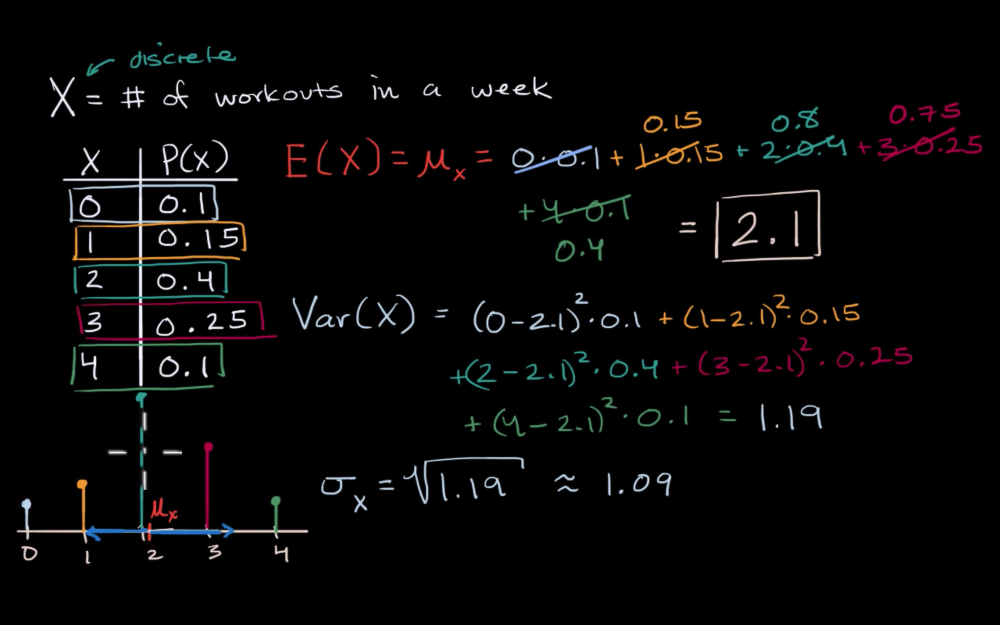
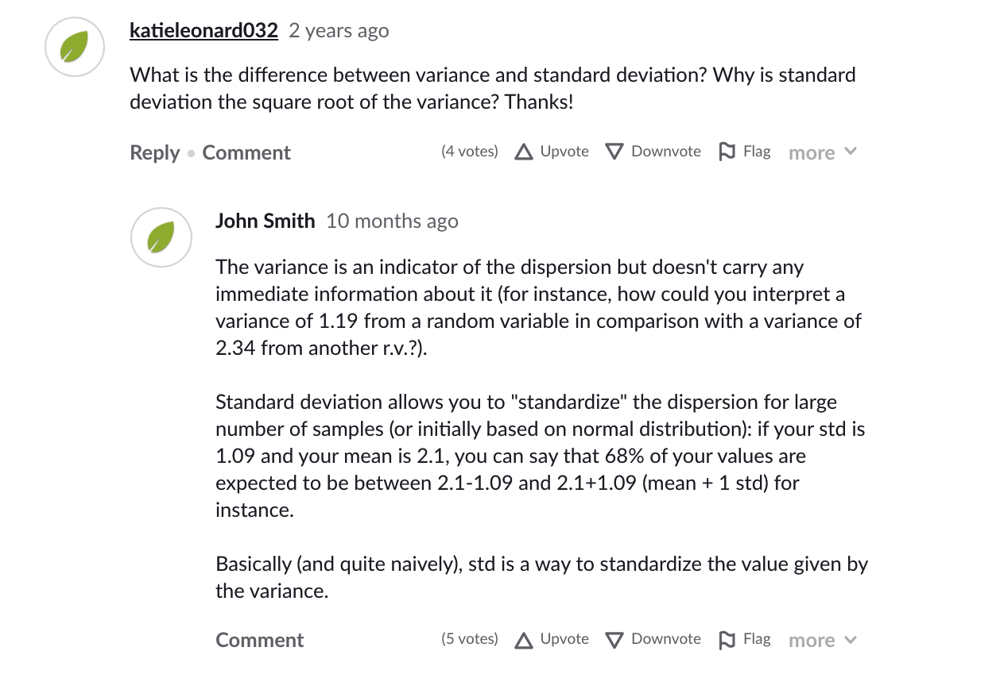
