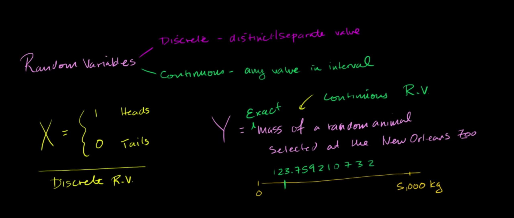

## Discrete Random Variables

## Random Variable Types

## Contructing a probability distribution for random variable

## Probabaility models example: frozen yogurt

## Valid probabaility distribution example

