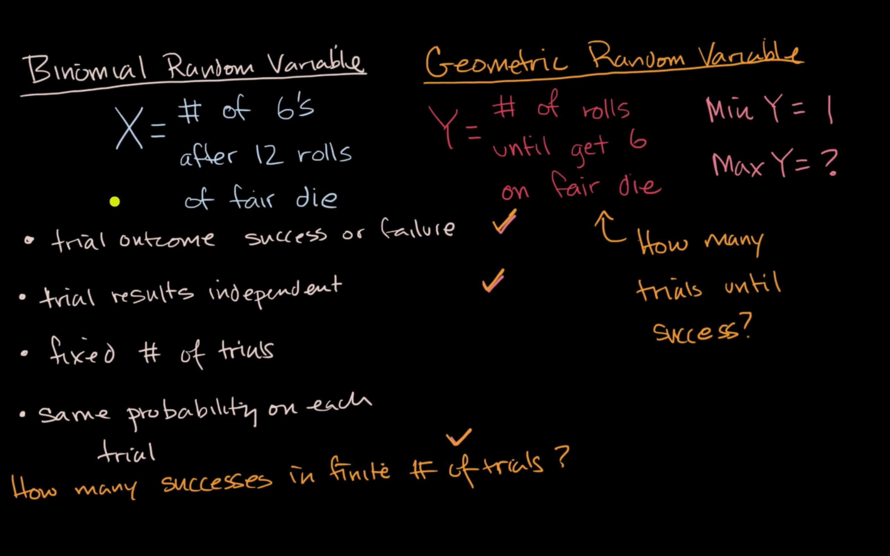
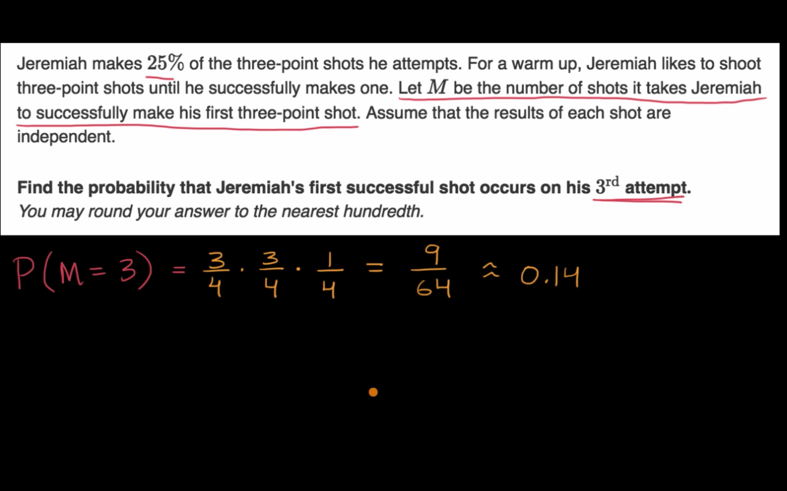
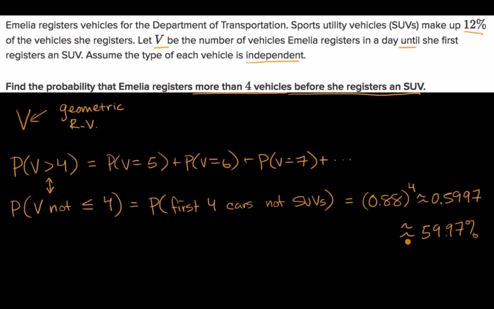
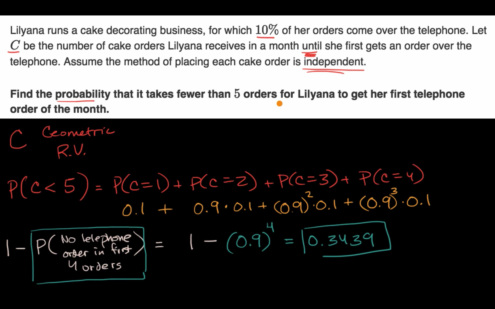
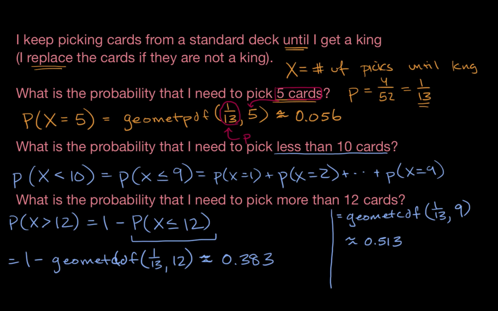
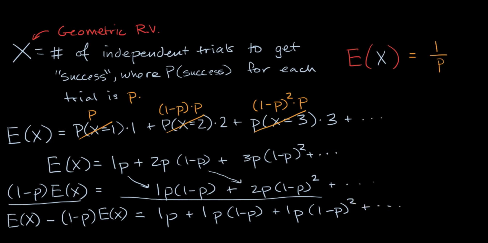
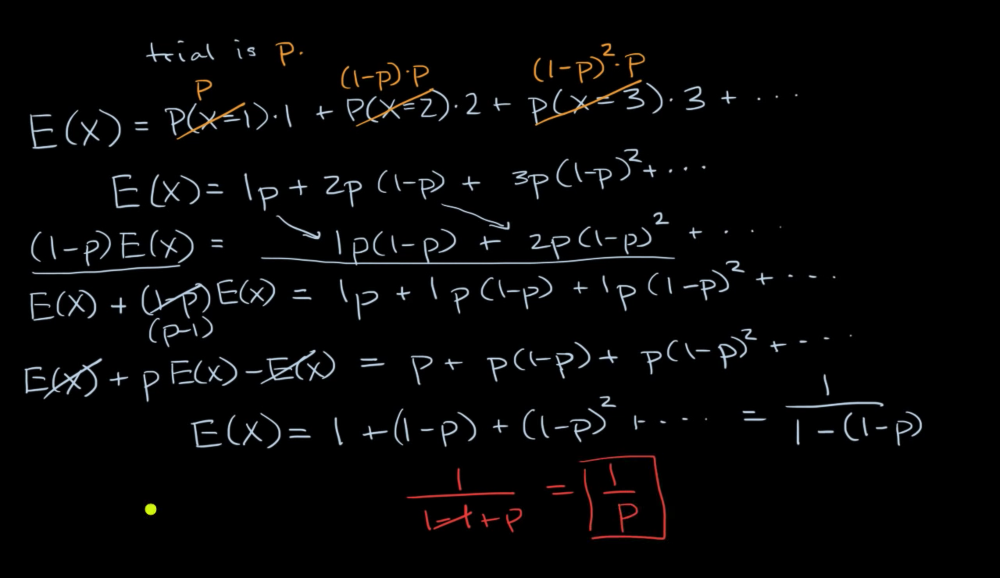

## Geometric random variables introduction

## Probability for a geometric random variable

## Cumulative geometric probability (greater than a value)

## Cumulative geometric probability (less than a value)

## geometpdf and geometcdf functions

## Proof of expected value of geometric random variable

