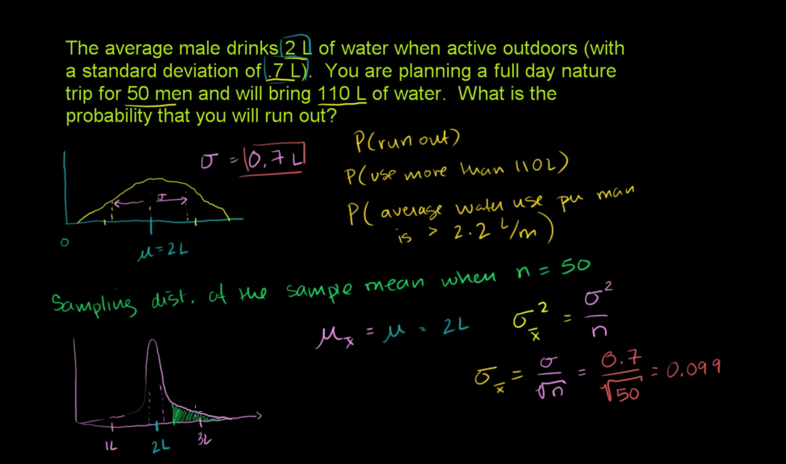

## Inferring population mean from sample mean

## Central limit theorem

## Sampling distribution of the sample mean (part 1)

## Sampling distribution of the sample mean (part 2)

## Standard error of the mean

## Example: Probability of sample mean exceeding a value

## Sampling distribution of a sample mean example

