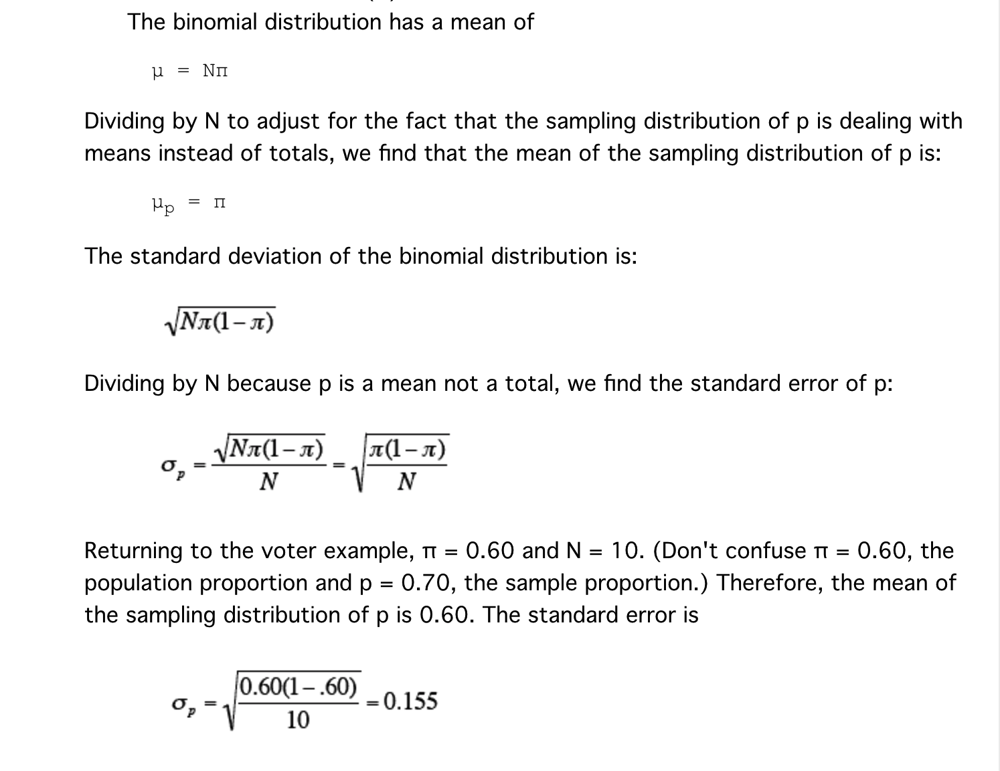
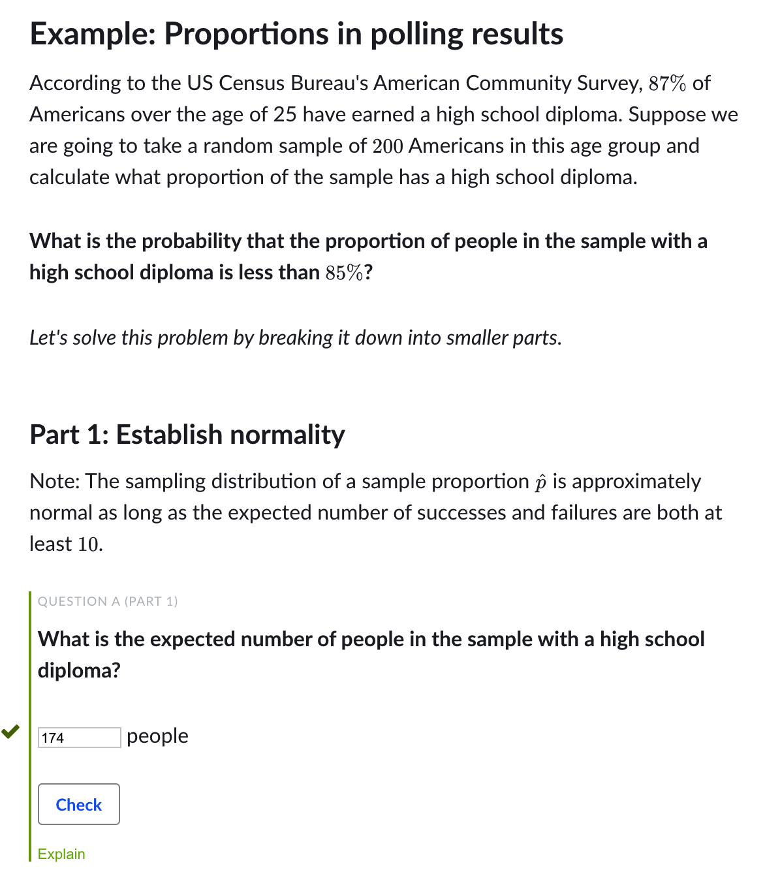
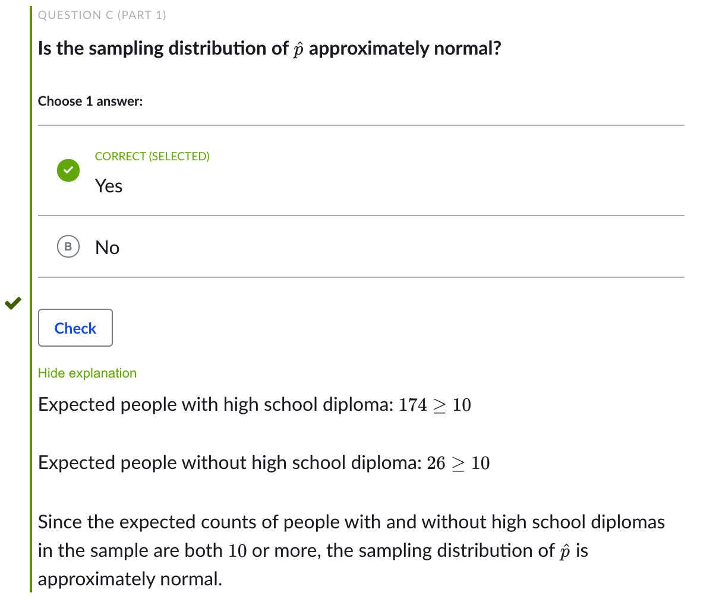
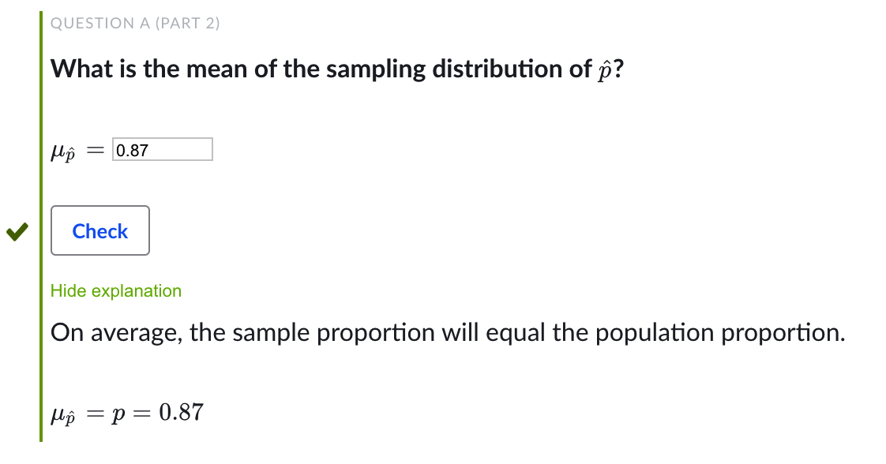
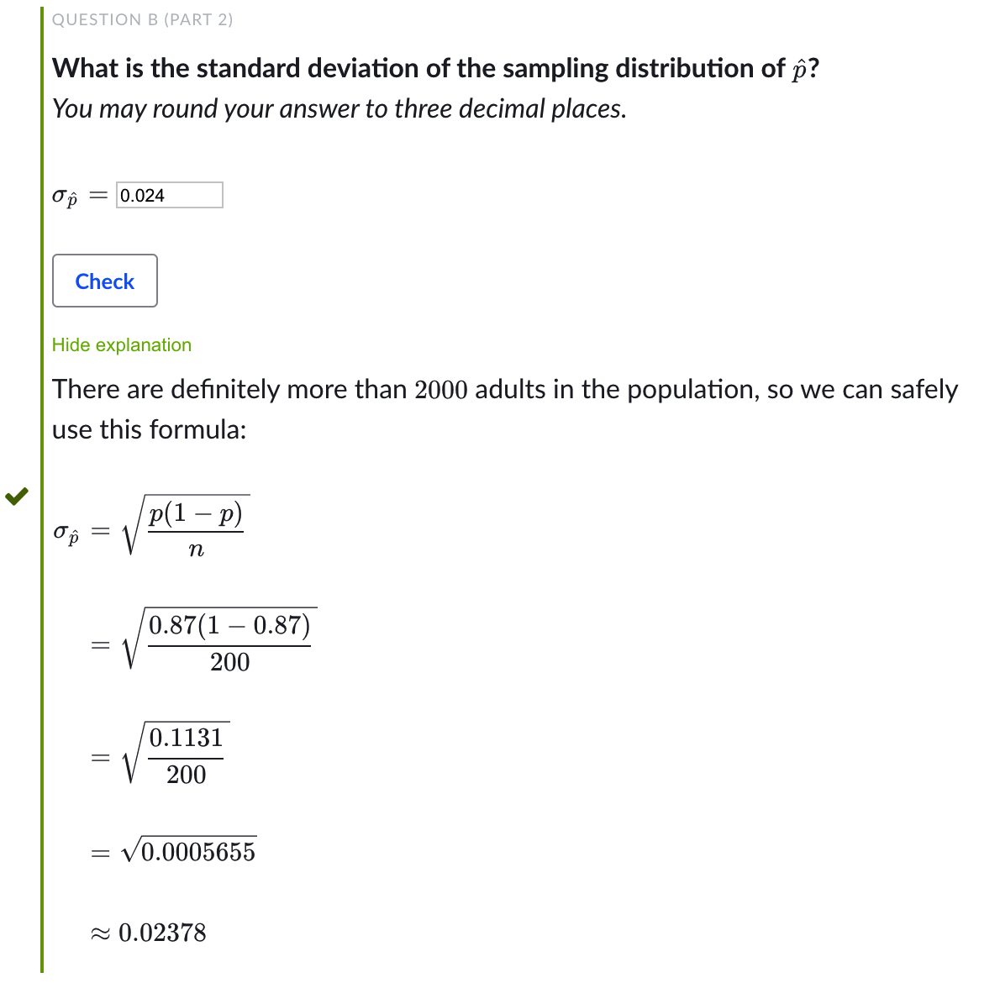
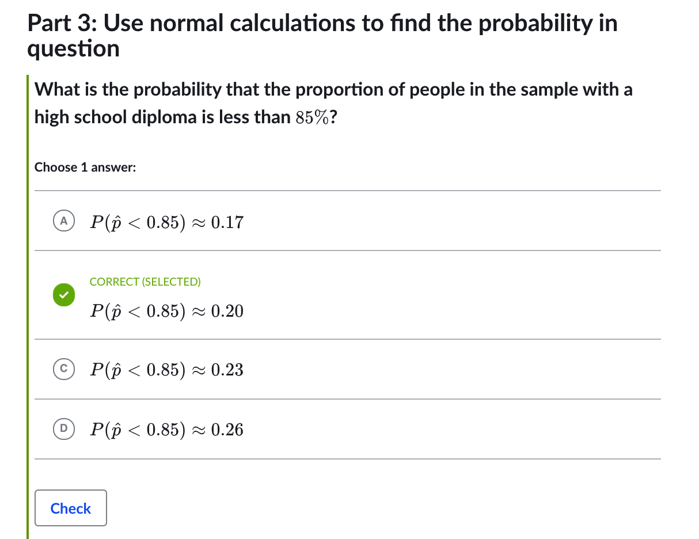
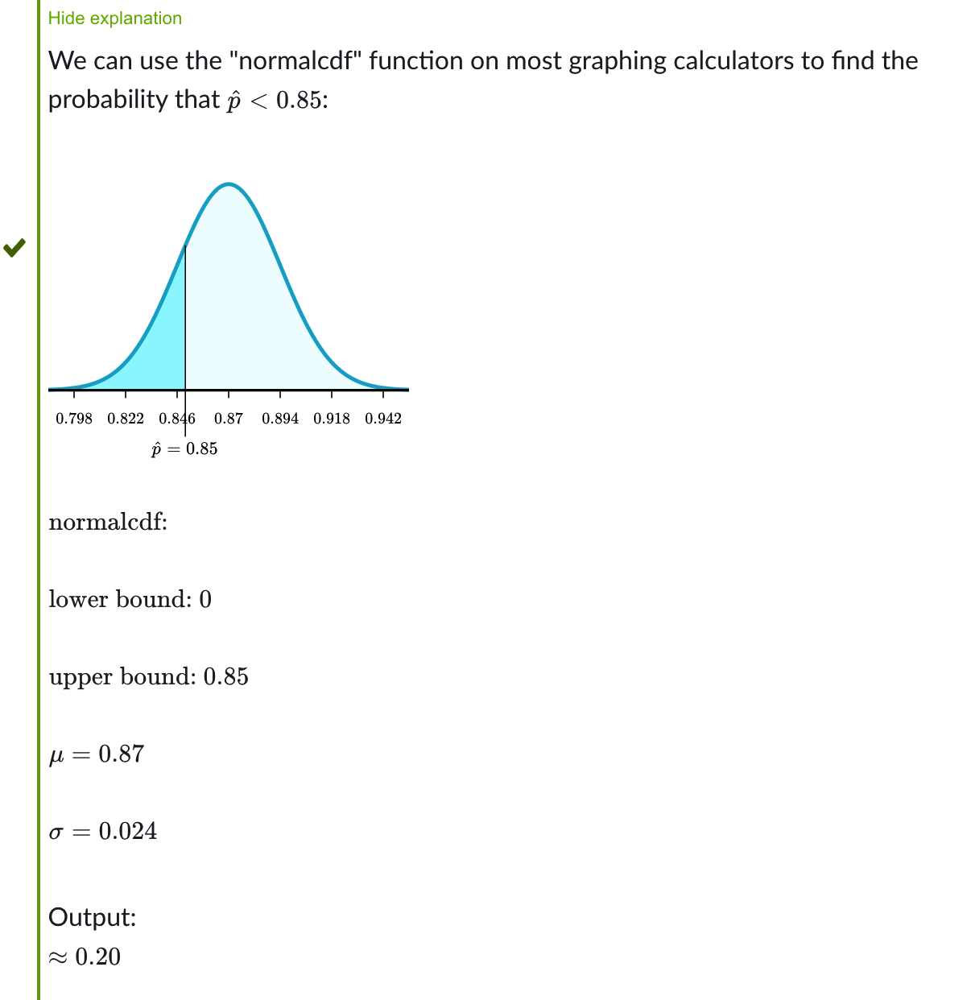
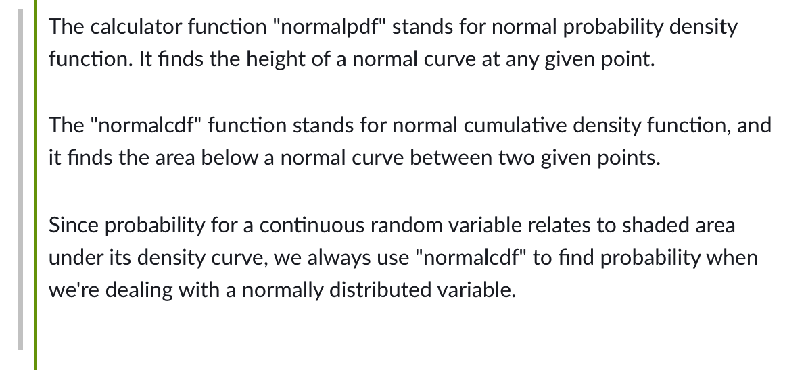
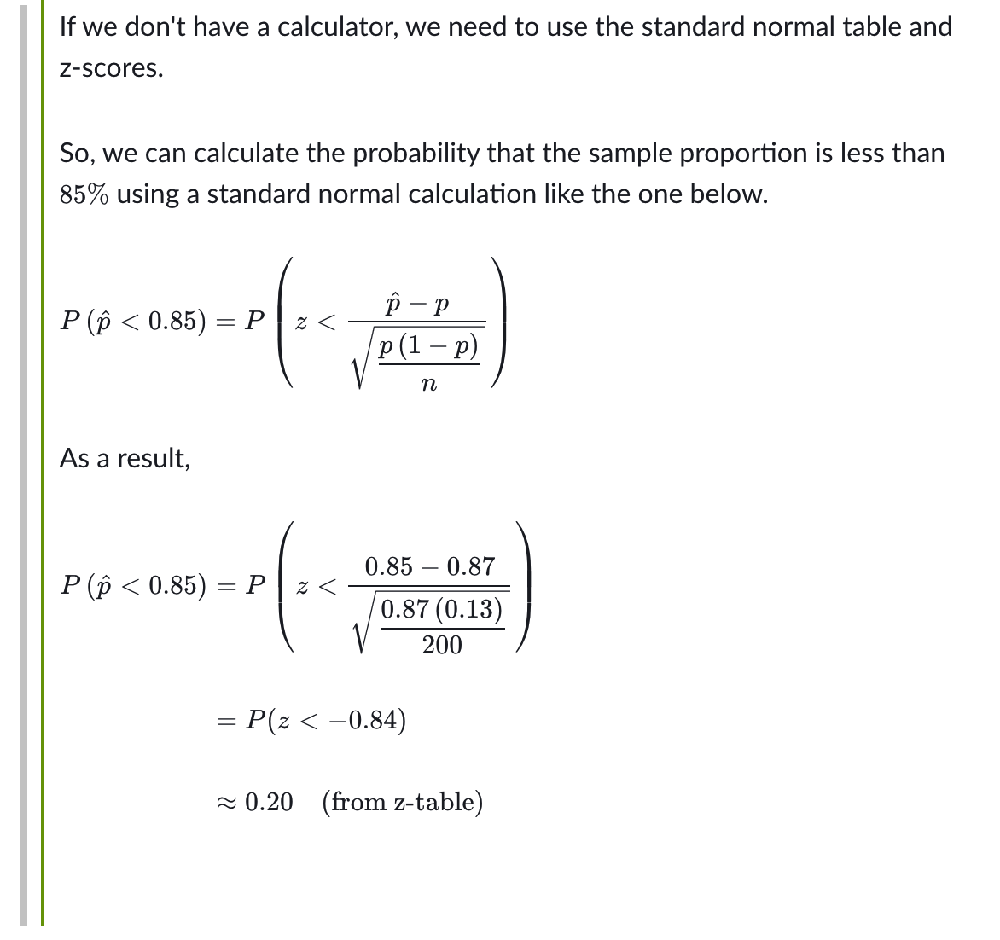

## Sampling distribution of sample proportion

## Comments

## Explanation

## Normal conditions for sampling distributions of sample proportions

## Check pdf file in the directory

## Sampling distribution of a sample proportion example

